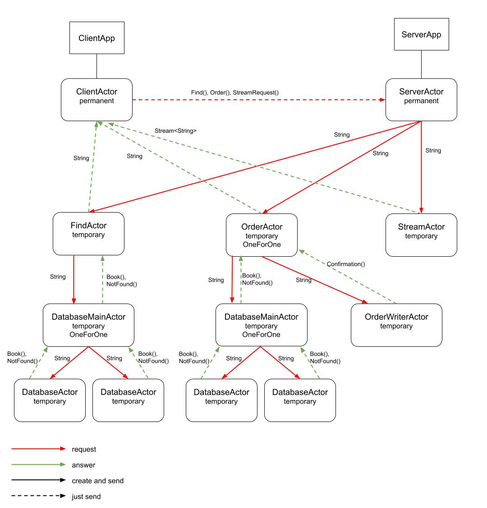

# Zadanie domowe
Obsługujemy księgarnię internetową  
Umożliwia ona 3 typy operacji:

- Wyszukiwanie pozycji (zwraca cenę lub informację o braku pozycji)
- Zamówienie pozycji (zwraca potwierdzenie zamówienia)
- Strumieniowanie tekstu książki – z prędkością jednej linijki (lub zdania) na sekundę

Założenia:

- Klient posiada aplikację (konsolową) opartą o platformę Akka
- Serwer to pojedyncza maszyna, z dużą ilością zasobów (ale nie nieskończoną)
- Chcemy być w stanie obsłużyć jak najwięcej klientów równolegle (na jednym serwerze)
- Chcemy zminimalizować czasy odpowiedzi systemu
- Chcemy zminimalizować ilość danych przesyłanych przez sieć (należy unikać przesyłania wszystkich wiadomości jako String)

Wyszukiwanie pozycji:

- Należy przeszukać dwie bazy danych
- Każda baza danych ma postać pliku tekstowego (jedna linia -> jeden tytuł + cena)
- Zakładamy, że jedna lub obie bazy mogą być czasowo niedostępne
- Zakładamy, że wyszukiwanie w bazie może być czasochłonne (należy przeszukiwać obie bazy równolegle)
- Jeśli jakaś pozycja jest w obu bazach to ma tę samą cenę

Zamówienie pozycji
- Następuje przez: zapisanie nowej linii z tytułem (bez ceny) do pliku orders.txt, który stanowi bazę zamówień oraz wysłanie potwierdzenia do klienta
- Należy zwrócić uwagę na synchronizację dostępu do pliku (bazy)

Strumieniowanie tekstu

- Klient wysyła tytuł, serwer odpowiada strumieniem linii lub zdań z pliku o tej nazwie
- Jedna linia(lub zdanie) na sekundę (throttle)

Obsługa błędów

- Należy zastosować odpowiednie strategie obsługi błędów

Schemat

- Należy przygotować schemat w wersji elektronicznej
- Schemat powinien zawierać zaproponowaną strukturę aktorów wraz ze wskazaniem ich cyklu życia (stały/tymczasowy, strategia obsługi błędów)

Punktacja

- Schemat 2 pkt
- Wyszukiwanie 4 pkt
- Zamówienia 2 pkt
- Strumieniowanie tekstu 2 pkt

Język

- Dowolny obsługiwany przez Akka

# Diagram

